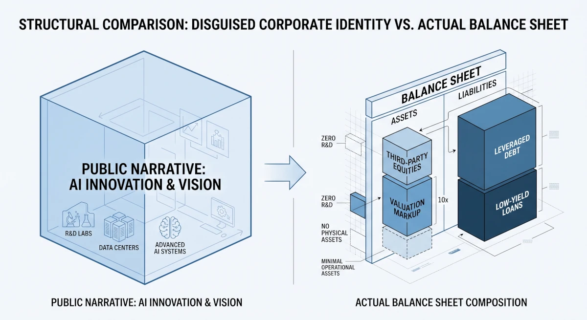

「企業」という言葉を聞いたとき、多くの人が思い浮かべるのはどんな姿でしょうか。

職人が技術を磨き、工場で地道にモノを作り、顧客に届ける。あるいは、独自のプロダクトを開発して社会の問題を解決する。そんな「手触りのある実体」を想像するのが普通です。

しかし、広報が打ち出す華やかなプレスリリースや、「イノベーション」「AI革命」といった美しい言葉（一次印象）を削ぎ落とし、法的な骨格である貸借対照表（B/S）という乾燥した事実だけを眺めてみると、まったく別の恐ろしい構造が浮かび上がることがあります。

自社の中には何一つ「実体（独自の技術やプロダクト）」が存在しない、「企業の皮を被ったナニか」の姿です。

#### アセットライトな「職人」と、アセットヘビーな「金融モンスター」

世の中の企業をB/Sの「質」と「中身」で解剖してみると、対極にある2つの面白い構造が見えてきます。

ひとつは、**「B/Sはコンパクトだが、目に見えない強固な核を持つ企業」**。 B/S上の数字（総資産）はそれほど巨大に見えなくても、表には載らない100年培ったブランド力や、他社が口出しできない圧倒的な加工技術、特許群を社内にぎっしりと抱えています。こうした企業は、たとえ市場が暴落しようが何が起きようが、社内に「代替不能な技術」という重たいアンカー（錨）が残るため、地殻変動に極めて強いのが特徴です。

もうひとつは、**「B/Sは異常に肥大化しているが、社内に自前の技術が一切ない企業」**。 数兆〜数十兆円という巨額の資産（B/Sの左側）を誇りながら、その中身を解剖すると、自社の工場も研究開発の蓄積もほぼゼロ。あるのは「他社の株」と「世界中から借り集めた巨額の負債（B/Sの右側）」だけです。

自前でゼロから技術を生み出すのではなく、他人が血汗を流して作った技術を巨額のマネーで買い集め、時価で評価してB/Sを膨らませる。 彼らの本質はイノベーターでもメーカーでもなく、「レバレッジ（借金）をテコにして時価の差分を抜く、超大型のヘッジファンド」そのものです。

#### なぜ彼らは「美しい言葉（擬態）」を被らなければならないのか？

ここで疑問が湧きます。 「自分たちは資本主義と税制のバグを突く金融マシーンです」と名乗ればいいのに、なぜ彼らは定期的に「未来を切り開くイノベーション」といった耳障りの良い物語を被り直すのでしょうか？

答えは簡単で、**B/Sを膨らませるためにその「擬態」が不可欠だから**です。

1. **安く資金（負債）を調達するための「物語」** 「ハイリスクなファンドです」と素顔のまま言っても、保守的な銀行や個人投資家はリスクを恐れてお金を貸してくれません。しかし、「日本の未来を創るAI革命の志」という美しい物語でラッピングすることで、低金利で莫大な資金を吸い上げることが可能になります。
2. **規制と税務調査から身を守るための「プロテクター」** 全世界の複雑な税制の隙間を突き、何兆円も稼ぎながら国に納める税金を極限まで削ぎ落とす手法は、世間や国税局から見れば摩擦の種です。「社会に変革を起こすIT起業家集団」というパブリックな看板があるからこそ、グレーゾーンのハッキングも「新産業の開拓に伴う挑戦のコスト」としてすり替えることができます。

つまり、彼らにとって「イノベーション」や「志」という綺麗な言葉は、B/Sに燃料（資金）を注ぎ込み、規制から身を守るためのレバレッジのパーツ（機能的な道具）に過ぎないわけです。